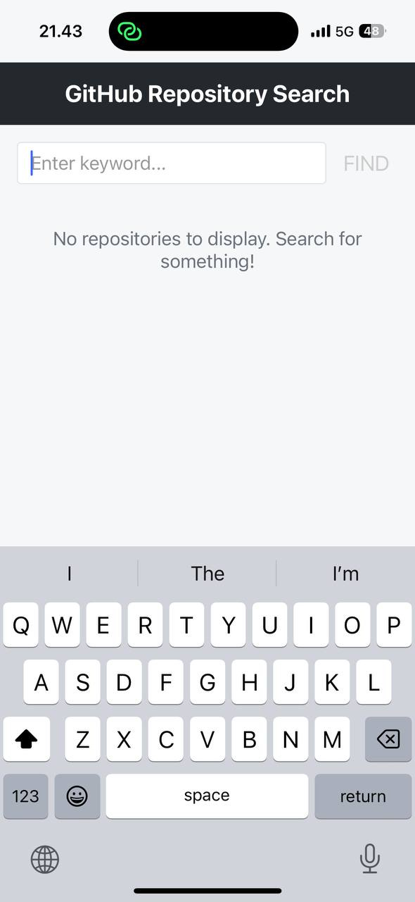
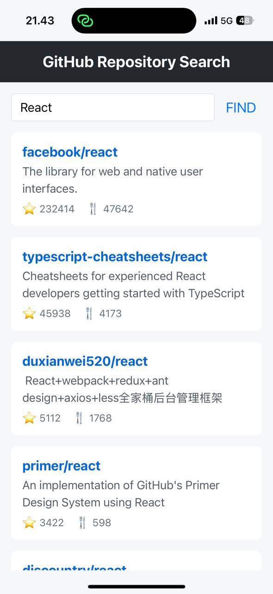

# GitHub Repository Search

A clean, well-structured React Native application that allows users to search for GitHub repositories using keywords. Built with modern React practices including custom hooks, component separation, and environment configuration.

## Screenshots

| App                                               | Results List                                           |
| ------------------------------------------------- | ------------------------------------------------------ |
|  |  |

## Features

- **Real-time GitHub repository search** - Find repositories as you type
- **Clean architecture** - Separation of concerns with dedicated API, components, and hooks
- **Responsive design** - Works on various device sizes
- **Error handling** - Graceful error management and user feedback
- **Loading states** - Visual feedback during network operations

## Technologies

- React Native
- Expo
- Custom Hooks
- Environment Variables
- GitHub REST API

## Project Structure

```
github-repo-search/
├── App.js                # Main app component
├── assets/               # App images and screenshots
├── src/                  # Source code
│   ├── api/              # API related code
│   │   └── github.js     # GitHub API calls
│   ├── components/       # Reusable components
│   │   ├── Header.js
│   │   ├── RepositoryList.js
│   │   └── SearchBar.js
│   ├── hooks/            # Custom hooks
│   │   └── useGithubSearch.js
│   ├── screens/          # Screen components
│   │   └── HomeScreen.js
│   ├── styles/           # Style files
│   │   ├── colors.js     # Color constants
│   │   ├── spacing.js    # Spacing constants
│   │   └── typography.js # Typography styles
│   └── utils/            # Utility functions
│       └── env.js        # Environment config
```

## Getting Started

### Prerequisites

- Node.js (14.x or newer)
- npm or yarn
- Expo CLI (`npm install -g expo-cli`)

### Installation

1. Clone the repository

   ```
   git clone https://github.com/emaDBytes/github-repo-search.git
   cd github-repo-search
   ```

2. Install dependencies

   ```
   npm install
   # or
   yarn install
   ```

3. Create a `.env` file in the root directory with:

   ```
   EXPO_PUBLIC_GITHUB_API_URL=https://api.github.com
   ```

4. Start the development server

   ```
   npx expo start
   ```

5. Open the app on your device using Expo Go or run on an emulator

## Usage

1. Enter a keyword in the search field
2. Tap the "FIND" button
3. Browse the list of matching GitHub repositories

## Future Improvements

- Repository details screen
- Search history
- User authentication
- Dark mode support
- Pagination for large result sets

## Contributing

Contributions are welcome! Please feel free to submit a Pull Request.

1. Fork the repository
2. Create your feature branch (`git checkout -b feature/amazing-feature`)
3. Commit your changes (`git commit -m 'Add some amazing feature'`)
4. Push to the branch (`git push origin feature/amazing-feature`)
5. Open a Pull Request

## License

This project is licensed under the MIT License - see the LICENSE file for details.

## Acknowledgments

- [GitHub API Documentation](https://docs.github.com/en/rest)
- [React Native Documentation](https://reactnative.dev/docs/getting-started)
- [Expo Documentation](https://docs.expo.dev/)
